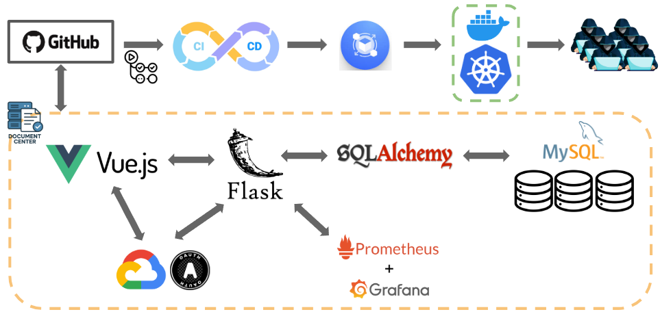

<!-- # Document Center -->
<p align="center">
  
</p>

<h1 align="center">Document Center</h1>

*A unified platform to upload, manage, and review enterprise documents.*



---

## Overview

**Document Center** is a centralized platform designed for enterprises to manage diverse technical and production documents. It enables users to upload, edit, and audit files within an integrated and secure environment. It ensures that document publishing adheres to review and approval workflows, which is critical for industries with compliance or traceability requirements.

## Tech Stack

| Layer        | Technology                          |
|-------------|--------------------------------------|
| Frontend     | Vue 3, Vite, Axios                   |
| Backend      | Flask, Flask-Login, SQLAlchemy       |
| Database     | MySQL 8                              |
| Auth         | Session-based login, Google OAuth    |
| Monitoring   | Prometheus, Grafana                  |
| CI/CD        | GitHub Actions                       |
| Deployment   | Docker, Docker Compose   |

## Features

### Authentication

- User registration and login with session support
- Password reset via email token
- Change password while logged in
- Role-based access: admin and non-admin users

### File Management

- Upload, list, and download files (per-user scoped)
- File metadata tracking: filename, MIME type, path, upload time
- File size limit enforcement (default: 256 MB)

### Frontend (Vue 3 + Vite)

- Upload/download UI with dynamic links
- Password reset prompt
- Axios-based API integration
- Responsive layout with a simple navigation bar

### Backend (Flask)

- RESTful API using Flask and Flask-Login
- File upload handling with `werkzeug`
- Token-based password reset support
- MySQL integration using SQLAlchemy
- CORS support with credentials

### Database (MySQL)

- Runs in Docker with persistent volume for data
- Auto-initialized by the backend (`init_db.py`)
- Accessible on host port `3307` (container port `3306`)

### Monitoring (Prometheus & Grafana)

- Real-time metrics exposed via `/metrics` endpoint (Flask + Prometheus)
- Prometheus scrapes metrics and Grafana dashboard for visualizing:
  - API usage statistics
  - Upload/download activity
  - System health (via Docker container stats)

---

## Getting Started

### Prerequisites

- [Docker](https://www.docker.com/)
- [Docker Compose](https://docs.docker.com/compose/)

### Running

1. **(Optional)** To enable Google OAuth login, create a `.env` file in the `./backend` directory with the following content:

```env
GOOGLE_CLIENT_ID = "your-google-client-id"
GOOGLE_CLIENT_SECRET = "your-google-client-secret"
```

2. Build and start the services:

```bash
docker-compose up --build
```

3. Access the application:
  - **Frontend**: [http://localhost:8080](http://localhost:8080)  
  - **Backend API**: [http://localhost:5001](http://localhost:5001)  
  - **phpMyAdmin**: [http://localhost:8081](http://localhost:8081)  
    > Login with:  
    > Host: `mysql`  
    > Username: `root`  
    > Password: `root`

4. Monitoring with Prometheus & Grafana

The stack includes basic observability for system metrics.

- **Prometheus**: [http://localhost:9090](http://localhost:9090)  
  > Scrapes metrics from the Flask backend (`http://localhost:5001/metrics`)

- **Grafana**: [http://localhost:3000/d/_eX4mpl3](http://localhost:3000/d/_eX4mpl3)