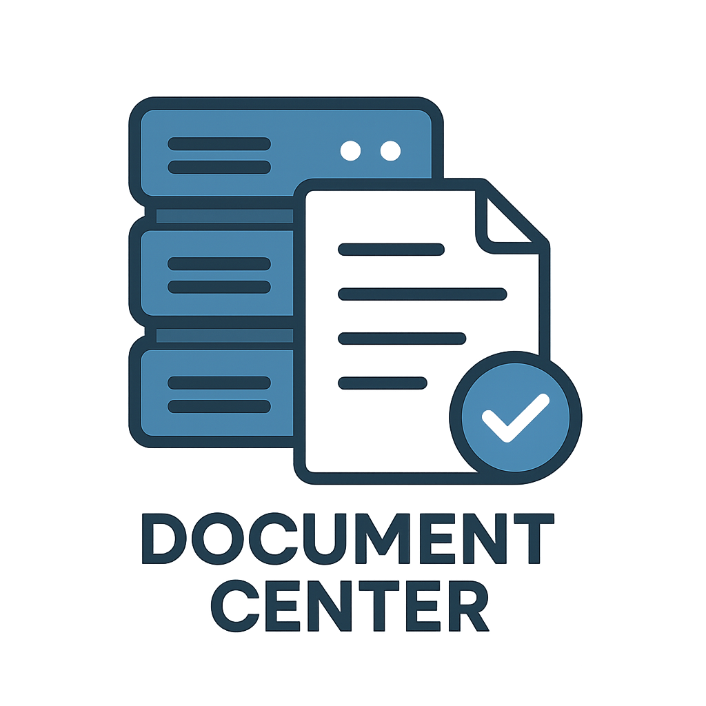
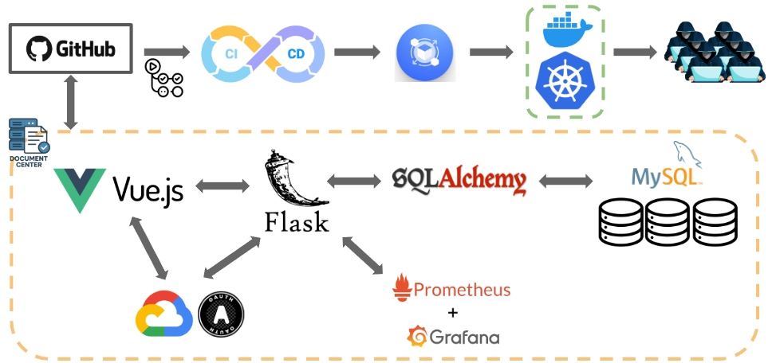

<!-- # Document Center -->
<p align="center">
  
</p>

<h1 align="center">Document Center</h1>

*A unified platform to upload, manage, and review enterprise documents.*



---

## Overview

**Document Center** is a centralized platform designed for enterprises to manage diverse technical and production documents. It enables users to upload, edit, and audit files within an integrated and secure environment. It ensures that document publishing adheres to review and approval workflows, which is critical for industries with compliance or traceability requirements.

## Tech Stack

| Layer        | Technology                          |
|-------------|--------------------------------------|
| Frontend     | Vue 3, Vite, Axios                   |
| Backend      | Flask, Flask-Login, SQLAlchemy       |
| Database     | MySQL 8                              |
| Auth         | Session-based login, Google OAuth    |
| Monitoring   | Prometheus, Grafana                  |
| CLI          | Python Click, Rich                   |
| CI/CD        | GitHub Actions                       |
| Deployment   | Docker, Docker Compose, Kubernetes   |

## Features

### Authentication

- User registration and login with session support
- Password reset via email token
- Change password while logged in
- Role-based access: admin and non-admin users

### File Management

- Upload, list, and download files (per-user scoped)
- File metadata tracking: filename, MIME type, path, upload time
- File size limit enforcement (default: 256 MB)

### Frontend (Vue 3 + Vite)

- Upload/download UI with dynamic links
- Password reset prompt
- Axios-based API integration
- Responsive layout with a simple navigation bar

### Backend (Flask)

- RESTful API using Flask and Flask-Login
- File upload handling with `werkzeug`
- Token-based password reset support
- MySQL integration using SQLAlchemy
- CORS support with credentials

### CLI Tool

- Command-line interface for server management
- Secure password authentication
- File upload, download, list, and delete operations
- Rich terminal UI with progress indicators
- Docker integration for easy deployment

### Database (MySQL)

- Runs in Docker with persistent volume for data
- Auto-initialized by the backend (`init_db.py`)
- Accessible on host port `3307` (container port `3306`)

### Monitoring (Prometheus & Grafana)

- Real-time metrics exposed via `/metrics` endpoint (Flask + Prometheus)
- Prometheus scrapes metrics and Grafana dashboard for visualizing:
  - API usage statistics
  - Upload/download activity
  - System health (via Docker container stats)

---

## Getting Started

### Prerequisites

- [Docker](https://www.docker.com/)
- [Docker Compose](https://docs.docker.com/compose/)

### Running

1. **(Optional)** To enable Google OAuth login, create a `.env` file in the `./backend` directory with the following content:

```bash
cd ./backend
cp .env.sample .env
```

2. Build and start the services:

- Docker:
```bash
docker-compose up --build
```

- k8s:
```bash
cd k8s
./start_k8s.sh
```

3. Access the application:
  - Docker: [http://localhost:8080](http://localhost:8080)
  - k8s: [http://localhost](http://localhost)

## CLI Usage

The Document Center includes a modular command-line interface for server management, available in two flavors:

### Option 1: Native CLI (Recommended)

Runs directly on your system - faster and can access any file path.

#### Quick Start

1. Start the services:
```bash
docker-compose up -d
```

2. Install and use the CLI:
```bash
# Navigate to CLI directory
cd cli

# Install dependencies
pip3 install -r requirements.txt

# Make scripts executable
chmod +x install.sh run.sh main.py

# Install locally
./install.sh

# Use the CLI
python3 main.py login admin admin123
python3 main.py list
python3 main.py upload /Users/username/Downloads/file.pdf
python3 main.py download myfile.txt
python3 main.py delete myfile.txt
python3 main.py status
```

### Option 2: Docker CLI

Runs in a Docker container - consistent environment across different systems.

#### Quick Start

1. Start the services:
```bash
docker-compose up -d
```

2. Use the CLI:
```bash
# Show help and current status
./run-cli-docker.sh

# Login to the server
./run-cli-docker.sh login admin admin123

# List all files
./run-cli-docker.sh list

# Upload a file (use /workspace/ for project files)
./run-cli-docker.sh upload /workspace/file.txt

# Download a file by filename
./run-cli-docker.sh download myfile.txt

# Delete a file by filename
./run-cli-docker.sh delete myfile.txt

# Show current status
./run-cli-docker.sh status
```

#### Alternative Docker Usage

You can also use docker-compose directly:

```bash
# Run CLI commands
docker-compose run --rm cli login admin admin123
docker-compose run --rm cli upload /workspace/file.txt
docker-compose run --rm cli list
docker-compose run --rm cli download myfile.txt
docker-compose run --rm cli delete myfile.txt
```

### CLI Commands

| Command | Description |
|---------|-------------|
| `login <username> <password>` | Login to the server |
| `register <username> <email> <password> [grade]` | Register a new account |
| `logout` | Logout and clear session |
| `list` | List all files in the server |
| `upload <file_path>` | Upload a file to the server |
| `download <filename> [output_path]` | Download a file by filename |
| `delete <filename>` | Delete a file by filename |
| `status` | Show current login status |

### CLI Features

- **Session Persistence**: Login sessions are maintained between commands
- **Filename-based Operations**: Use filenames instead of IDs for download/delete
- **Rich Terminal UI**: Beautiful progress indicators and formatted output
- **Interactive Mode**: Run without arguments to see help and status
- **Cross-platform**: Works on macOS, Linux, and Windows

For detailed CLI documentation, see [cli/README.md](cli/README.md).

### Installation

#### Native CLI
The CLI automatically installs its dependencies when first run. If you encounter any issues:

```bash
# Install dependencies manually
pip3 install -r requirements-cli.txt

# Make the CLI executable
chmod +x doccli.py
```

#### Docker CLI
The Docker CLI is automatically built when you run docker-compose:

```bash
# Build the CLI container
docker-compose build cli

# Or build all services
docker-compose up --build
```

### Alternative Usage

You can also run the CLI directly:

```bash
# Native CLI
python3 doccli.py login admin admin123
python3 doccli.py

# Docker CLI
docker-compose run --rm cli login admin admin123
docker-compose run --rm cli
```
